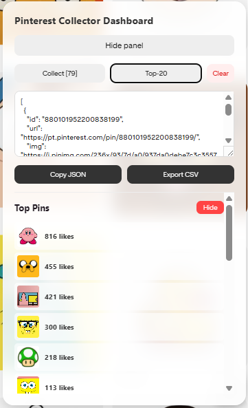

# Pinterest Pin Collector

A lightweight, powerful tool for automating data collection from Pinterest. This script allows you to extract information about pins (URL, image, and like count) directly from the browser interface without manual navigation, storing your data persistently across sessions.

## Interface Preview

## Installation & Usage (via Tampermonkey)

To run this script effectively, we recommend using the **Tampermonkey** extension:

1. Install the [Tampermonkey](https://chrome.google.com/webstore/detail/tampermonkey/dhdgffkkebhmkfjojejmpbldmpobfkfo) extension from the Chrome Web Store.
2. Click the Tampermonkey icon in your browser toolbar and select **"Create a new script"**.
3. Delete the default content and paste the entire script code.
4. Save the file (`Ctrl+S`).
5. Refresh your Pinterest page. A control panel will automatically appear in the bottom-right corner.

## Key Features

* **One-Click Collection:** Rapidly parse pin data from the current page.
* **Persistent Sessions:** Data is automatically saved to the browser's `localStorage`, ensuring no loss of progress upon refresh.
* **Analytics:** Includes an automated "Top-20" report that highlights the most popular pins in your current session.
* **Flexible Export:** Easily copy your results as **JSON** to your clipboard or download a formatted **CSV** file.
* **Optimized UI:** A modern "glassmorphism" control panel designed for accessibility and scale.

## Control Panel Guide

* **Collect:** Scans the page and adds new pins to your database.
* **Top-20:** Displays the top pins by like count with a hover effect for easy navigation.
* **Clear All:** Resets your session and wipes the cached data from your browser.
* **Export Tools:** Buttons to copy JSON or download the CSV file.

## Technical Details

* **Language:** Vanilla JavaScript (zero dependencies).
* **Storage:** Uses `localStorage` to maintain state.
* **Parsing:** Leverages `DOMParser` for efficient HTML analysis.

---
*Disclaimer: This tool is intended for personal use and automating the collection of publicly available data. Please adhere to Pinterest's Terms of Service.*